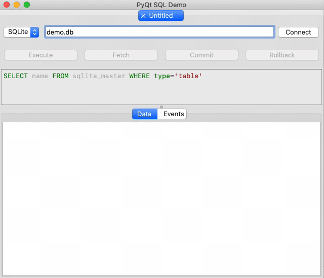

# PyQT based SQL query executor demo example




This is a demo example of using PyQT and SQLite via standard Python DB-API interface. 
It's created to be used as a tutorial or reference. 
It uses `QtWidgets` for interface, `QTableView` for displaying SQL query results, `pygments` for syntax highlighting, and `sqlite3` for db connection.

## Features

* Executes user's DDL/DML SQL queries 
* Python3, PyQt5, DB-API 2.0 (does not use QtSql!)
* Connection string field available to user (default: local `demo.db` file)
* Query field available to user
* SQL syntax highlighting using `pygments` library
* Buttons to execute or fetch query and to commit or rollback the results
* QTableView is used to display results

## Installation & Usage

### Using pip (end user installation)

Install it from PyPI into your Python. This is a no-development way to install the package. An executable `pyqtsqldemo` will become available to you in your `PATH` environmental variable.

```shell
$ pip3 install pyqt-sql-demo
```

Launch via terminal.

```shell
$ pyqt-sql-demo
```

### Using poetry (development)

Install the package into a virtual environment using Poetry.

```shell
$ poetry install
```

Run using poetry.

```shell
$ poetry run pyqt-sql-demo
```

## Development

### Use pyenv

I recommend installing and using `pyenv` to manage isolated Python versions on your machine that do not interfere with your system wide Python installation and with other Python versions.
For example, you might have Python 2.7.15 as your system default interpreter, but at the same time you need both Python 3.7.2 for some other projects and Python 3.8.5 for this project installed on the same machine. Best way to achieve this is to use `pyenv`.

After installing `pyenv` install suitable Python version. This project was developed using Python 3.6 but was later upgraded to support latest 3.8.5.

```shell
$ pyenv install 3.8.5
```

You'll notice `.pyenv-version` file in the root directory of the project, so whenever you `cd` into project directory `pyenv` will automatically start using Python version specified in that file in this directory.

### Use poetry

Poetry is the latest and most admirable python package manager in existence (as of 2020). This project is packed and distributed using Poetry. 

The command below executed in the project's root directory will set up a virtual environment using current python version (system wide or the one specified using `.pyenv-version` file) and install all required dependencies into that virtual environment.

```shell
$ poetry install

Installing dependencies from lock file
```

Make modifications and run project:

```shell
$ poetry run pyqt-sql-demo
```

Make sure you run [Black](https://github.com/psf/black) to format everything properly:

```shell
$ poetry run black .

All done! ✨ 🍰 ✨
11 files left unchanged
```

Build project using poetry

```shell
$ poetry build

Building pyqt-sql-demo (1.0.0)
 - Building sdist
 - Built pyqt-sql-demo-1.0.0.tar.gz

 - Building wheel
 - Built pyqt_sql_demo-1.0.0-py3-none-any.whl
```

## Bug reporting

Please create an issue in GitHub Issues for this project if you have a question or would like to report a bug. When reporting an issue be sure to provide as many details as possible and use proper formatting.

Nice details to provide when opening an issue:

* Reliable way to reproduce a bug/issue
* What was expected?
* What you got instead?
* What is your suggestion or clarification question?
* Screenshots
* Logs

## License

Copyright © 2020 Vagiz Duseev

Permission is hereby granted, free of charge, to any person obtaining a copy of this software and associated documentation files (the “Software”), to deal in the Software without restriction, including without limitation the rights to use, copy, modify, merge, publish, distribute, sublicense, and/or sell copies of the Software, and to permit persons to whom the Software is furnished to do so, subject to the following conditions:

The above copyright notice and this permission notice shall be included in all copies or substantial portions of the Software.

THE SOFTWARE IS PROVIDED “AS IS”, WITHOUT WARRANTY OF ANY KIND, EXPRESS OR IMPLIED, INCLUDING BUT NOT LIMITED TO THE WARRANTIES OF MERCHANTABILITY, FITNESS FOR A PARTICULAR PURPOSE AND NONINFRINGEMENT. IN NO EVENT SHALL THE AUTHORS OR COPYRIGHT HOLDERS BE LIABLE FOR ANY CLAIM, DAMAGES OR OTHER LIABILITY, WHETHER IN AN ACTION OF CONTRACT, TORT OR OTHERWISE, ARISING FROM, OUT OF OR IN CONNECTION WITH THE SOFTWARE OR THE USE OR OTHER DEALINGS IN THE SOFTWARE.
